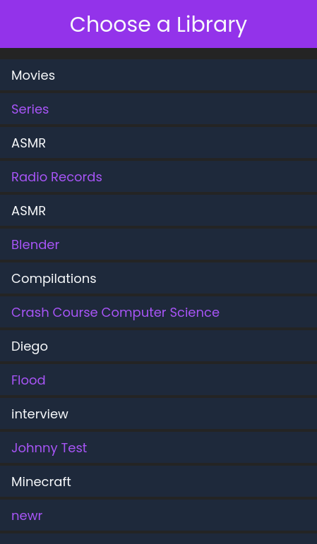
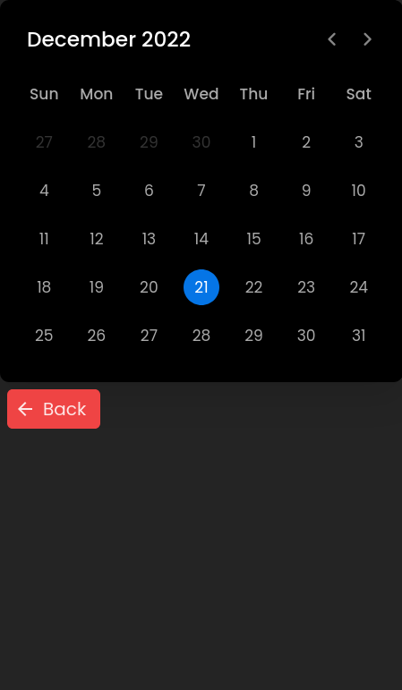
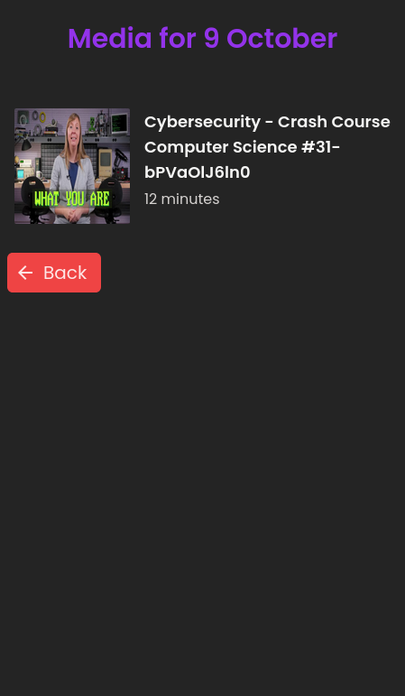
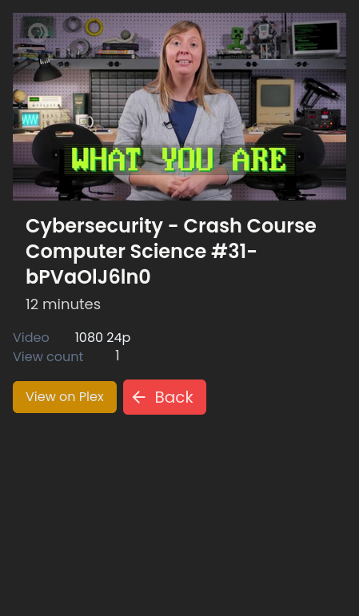

# Plex Calendar
Basic interface to view items which were added to your plex media libraries on a given calendar date

## 📝 Getting Started

```bash
# clone it
git clone git@github.com:JChris246/plex-calendar.git
cd plex-calendar

# Install server dependencies
cd server
npm install

# Install client dependencies
cd client
npm install

# Run the client and the server
cd client
npm run dev

cd server
npm start
```

<i>Note a .env file should be created and filled in with the appropriate values based on the .env.sample file.

## 🐋 Docker 

Should you choose to run as a docker container, the docker compose in the root of the project can be used run start the service with the command `docker-compose up -d`. With the first run, the image will be built using the Dockerfile also found in the root of the project. If you need to rebuild the image after the first run of docker compose, the image can be built with the `docker build .` or `docker-compose up --build -d` command from server dir of the project. If you run the commands outside of this directory you will also need to specify where to find the env vars.

<br/>

# 🚀 Previews





